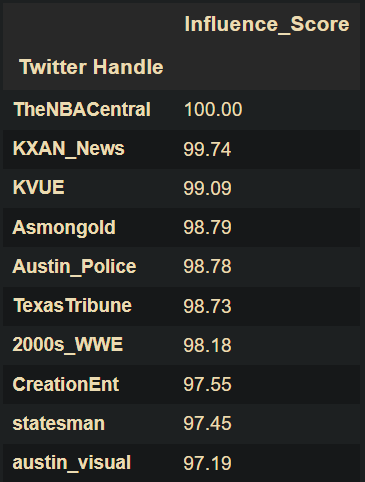

# Social-Media-Influencer-Analysis

### Goal

Identify which Twitter users are most influential in Austin city community and factors drive that influence.

### Installation

Use the following command to create a new environment with all required libraries:

```Python
conda create --name <environment name> --file requirements.txt
```

Please note, you need to create your own credentials for Twitter API.

Save the credentials in a json file 'credentials.json' with the following structure:

```json
{
    "consumer_key": "<<enter your consumer_key here>>",
    "consumer_secret": "<<enter your consumer_secret here>>",
    "bearer_token":"<<enter your bearer_token here>>",
    "access_token":"<<enter your access_token here>>",
    "access_token_secret":"<<enter your access_token_secret here>>"
}
```


### Data Sources

### For part-1: Kaggle network dataset - [Influncers in Social Networks](https://www.kaggle.com/competitions/predict-who-is-more-influential-in-a-social-network) 
### For part-2: Tweets about Austin city from Twitter API

### Approach

#### Part-1

* Feature Engineer by transformations and network features (degree, centrality and closeness)
* Evaluate models to identify influencers from the Kaggle dataset. We found Logistic Regression with LASSO penality to work best.
* Note important factors and their polarity that contribute to influence
* Quantify financial benefit of the model through cumulative lift in profits from influencer marketing

#### Part-2

* Fetch 5000 tweets about Austin city through Twitter API
* Visualize network of users based on retweets. This identifies influencers visually.
* Calculate important factors of influence identified from Part-1 and network features (degree, centrality and closeness)
* Scale these factors using weights from Part-1's Logistic Regression model
* Calculate influence score by summing these scaled influence factors
* Users with high influence scores are our Austin city influencers on Twitter

### Insight

Below influential twitter users talking about Austin city are identified by the model - 



These handles belong to news reporters, meteorologists, police departments and sports entities. The fluctuating weather and winter storm when we collected the data must be why meteorologists are influential in Austin.

Detailed analysis of influencers, financial benefits of model and factors driving influence enclosed in notebook.
